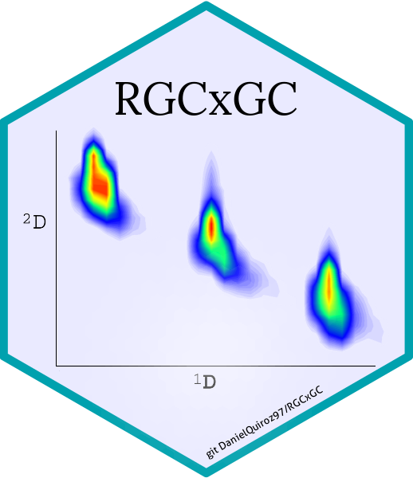

<!-- Place this tag in your head or just before your close body tag. -->
<script async defer src="https://buttons.github.io/buttons.js"></script>



<!-- README.md is generated from README.Rmd. Please edit that file -->
<!-- badges: start -->
[](https://cran.r-project.org/package=RGCxGC)
[](https://cran.r-project.org/package=RGCxGC)
[](https://cran.r-project.org/package=RGCxGC)
[](https://cran.r-project.org/package=RGCxGC)
<!-- Place this tag where you want the button to render. -->
<a class="github-button" href="https://github.com/DanielQuiroz97/RGCxGC/archive/master.zip" data-icon="octicon-cloud-download" aria-label="Download DanielQuiroz97/RGCxGC on GitHub">Download</a>
<!-- badges: end -->

```{r setup, include = FALSE}
knitr::opts_chunk$set(
  collapse = TRUE,
  comment = "#>",
  fig.path = "man/figures/README-",
  out.width = "100%"
)
```

# RGCxGC

The goal of RGCxGC is to provide an easy-to-use platform to analyze
two-dimensional gas chromatography data. RGCxGC offers common pre-processing 
algorithms for signal enhancement, such as baseline correction based on
[asymetric least squares](https://pubs.acs.org/doi/abs/10.1021/ac034800e), 
smoothing based on the [Whittaker smoother](https://pubs.acs.org/doi/abs/10.1021/ac034173t), and
peak alignment [2D COW](https://pubs.acs.org/doi/abs/10.1021/ac7024317). 
Furthermore, the multiway principal component analysis is implemented based
on the [Wold's approach](https://onlinelibrary.wiley.com/doi/abs/10.1002/cem.1180010107).


<!-- Links: start -->
|   Quick Links  |
|:-------|
| [**RGCxGC Paper**](https://www.sciencedirect.com/science/article/abs/pii/S0026265X20304914) |
| [**Installation**](https://github.com/DanielQuiroz97/RGCxGC#Installation) |
| [**CRAN Version**](https://cran.r-project.org/package=RGCxGC) |

|   Tutorials  |
|:-------|
| [**Introduction to RGCxGC package**](https://cran.r-project.org/web/packages/RGCxGC/vignettes/Explanation.html) |
| [**Customizing 2D chromatogram visualization**](https://cran.rstudio.com/web/packages/RGCxGC/vignettes/plotting_chromatograms.html)|

<!-- Links: end -->


## Installation

Install the released version of RGCxGC from [CRAN](https://CRAN.R-project.org) with `install.packages("RGCxGC")`.

Install the working version of RGCxGC from [GitHub](https://github.com) with `devtools::install_github("DanielQuiroz97/RGCxGC")`.

## Citing RGCxGC
Quiroz-Moreno, C., Furlan, M. F., Belinato, J. R., Augusto, F., Alexandrino,
G. L., & Mogollón, N. G. (2020). RGCxGC toolbox: An R-package for data 
processing in comprehensive two-dimensional gas
chromatography-mass spectrometry. Microchemical Journal, 156, 104830.
[https://doi.org/10.1016/j.microc.2020.104830](https://doi.org/10.1016/j.microc.2020.104830)


## References
Eilers, P. H. (2003). A Perfect Smoother. Analytical Chemistry, 75(14),
3631-3636. [https://doi.org/10.1021/ac034173t](https://doi.org/10.1021/ac034173t)

Eilers, P. H. (2004). Parametric Time Warping. Analytical Chemistry, 76(2),
404-411. [https://doi.org/10.1021/ac034800e](https://doi.org/10.1021/ac034800e)

Wold, S., Geladi, P., Esbensen, K., & Öhman, J. (1987).
Multi-way principal components-and PLS-analysis. Journal of Chemometrics, 1(1),
41-56. [https://doi.org/10.1002/cem.1180010107](https://doi.org/10.1002/cem.1180010107)

Zhang, D., Huang, X., Regnier, F. E., & Zhang, M. (2008). Two-Dimensional
Correlation Optimized Warping Algorithm for Aligning GC×GC−MS Data.
Analytical Chemistry, 80(8), 2664-2671. 
[https://doi.org/10.1021/ac7024317]([https://doi.org/10.1021/ac7024317])
