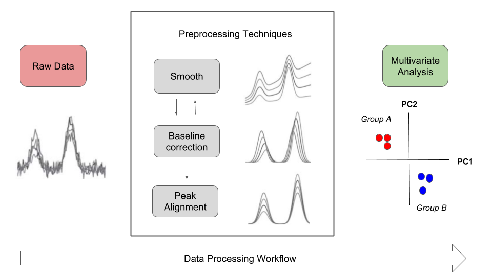
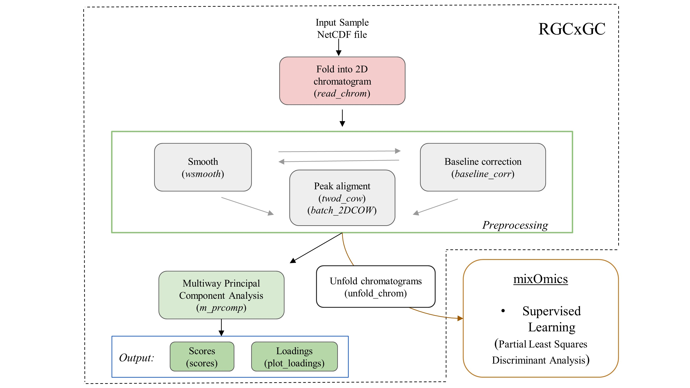

<style>
body {text-align: justify}
</style>

# Introduction
This is the vignette to explain the implementation of RGCxGC package. This text presents an end-to-end pipeline for the analysis of comprehensive two
dimensional gas chromatography (GCxGC-MS) data. You can access a specific function 
help through the command help(*['function name']*). 

A general workflow about signal preprocessing in chromatography is summarized in
Figure 1. Raw chromatographic signals usually contains undesirable artifacts,
such as chemical and instrumental noise. Therefore, noise in the
data should be removed prior statistical analysis. Furthermore, noise can be
significantly reduced by using preprocessing algorithms,
herein smoothing, baseline correction, and peak alignment. Then, in order to reveal differences between groups, multivariate analysis can be performed.

```{r Fig 1, echo=FALSE, fig.cap= "Figure 1. Overview of general data processing pipeline in chromatography that is presented in the RGCxGC package.", out.width= "80%",message=FALSE, warning=FALSE, paged.print=FALSE, fig.align='center'}

```

In the RGCxGC package, first, the raw chromatogram is importing from a **NetCDF** file and is folded
into the two-dimensional Total Intensity Chromatogram (2D-TIC). Next,
you can perform three preprocessing methodologies in order to enhance signals,
such as smooth, baseline correction, and peak alignment. Basically,
smooth enhance the signal to noise ratio (S/N), baseline correction  handles
column blooding, and peak alignment corrects the retention time shift of the peaks
across multiple runs. Finally, you can perform a multiway principal component
analysis (MPCA) to look for systematic patterns that distinguish your samples.

## Basic workflow
The basic workflow of the RGCxGC package is composed of two main steps,
preprocessing and multivariate analysis, after the data is imported (Figure 2).

```{r Fig 2, echo=FALSE, fig.align="center", fig.cap="Figure 2. The basic workflow of RGCxGC package. The functions for each step are in parenthesis. The double line between smooth andbaseline correction refers to the interchangeable pathway.", message=FALSE, warning=FALSE, out.width="80%", paged.print=FALSE}

```

The raw NetCDF file is imported with the **read_chrom** function, by providing
the file name and modulation time that the GCxGC data was acquired.
Next, you can perform preprocessing routines like smoothing and/or baseline
correction by using the function **wsmooth** and **baseline_corr**, 
respectively. Then, peak alignment of a single sample against a reference chromatogram
can be performed based on the two-dimensional
correlation optimized warping (2DCOW) algorithm. Alternatively, multiple sample
alignment can be performed with **batch_2DCOW** function. 
After signal preprocessing, MPCA can be performed over the dataset by using
the **m_prcomp** functions. As result of the MPCA, you can access to the score
matrix through **scores** function, or plot the loading matrix with the
**plot_loading** function. Finally, the MPCA summary can be retrieved with
the **print_mpca** function. On the other hand, the RGCxGC package can export the
two-dimensional chromatograms in order to perform supervised models. It can
be done through **unfold_chrom**. Supervised models can be done with the
[mixOmics](https://bioconductor.org/packages/release/bioc/html/mixOmics.html) functions.

# Detailed workflow
## Installation
You can install the package in different manners. The most common is to 
install it from CRAN.

```{r Cran install, eval=FALSE, include=TRUE}
install.packages("RGCxGC")
```

Another way is to install it is through the developer version in github.
```{r github install, eval=FALSE, include=TRUE}
library(devtools)
install_github("DanielQuiroz97/RGCxGC")
```

Once you have successfully installed the package, you can acces to every
functions and data provided by calling the library.

```{r library call}
library(RGCxGC)
```


## Importing raw chromatogram
The example data is retrieved form
[Diagnostic metabolite biomarkers of chronic typhoid carriage](https://journals.plos.org/plosntds/article?id=10.1371/journal.pntd.0006215).
You can access to the whole dataset with the identifier
[MTBLS579](https://www.ebi.ac.uk/metabolights/MTBLS579) in the
[MetaboLights](https://www.ebi.ac.uk/metabolights/) database.

You can import the raw chromatogram through the **read_chrom** function. This function
requires at least two parameters: the name of the *NetCDF* file (name), and
the modulation time. This is an adaptation of Skov routine @Skov2008.

```{r Chrom import}
chrom_08 <- system.file("extdata", "08GB.cdf", package = "RGCxGC")
MTBLS08 <- read_chrom(chrom_08, mod_time = 5)
slotNames(MTBLS08)
```
As we can see, the MTBLS08 object has four slots. The first one correspond to the
2D-TIC chromatogram. The second slot refers to
the retention time in the first dimension. The third slot is the name of the
NetCDF file, which is first check for validity before importing the chromatogram.
Finally, the fourth slot is the modulation time in the second dimension.

## Chromatogram visualization
To visualize chromatograms, you can use the **plot** function.
It is built from **filled.contour** R base function. Since contour plots
is a good choice to display non-native GCxGC data [@Reichenbach2004].
The default function only plots the most intense signals, into a few breaks.
For a detailed tutorial on 2D chromagram visualization, please
visit the
[tutorial web site](https://danielquiroz97.gitlab.io/post/plotting-chromatograms/).


Due to the large variety of  metabolite concentrations in a sample,
the total ion current can also have large variability in the intensity scale.
Therefore, you have to set the number of levels in hundreds.
As the number of levels increases, you can obtain
a more detailed chromatogram. On the other hand, you can use color palettes
presented in the *colorRamps* package (matlab.like & matlab.like2).

```{r Chrom plot, message=FALSE, warning=FALSE, paged.print=FALSE, out.width= "60%"}
# nlevels: Number of levels
# color.palette: The color palette to employ
library(colorRamps)
plot(MTBLS08, nlevels = 100, color.palette = matlab.like2)
```

## Signal preprocessing
In chromatography, the net metabolite signals are often obscured by
instrumental and chemical noise. These undesirable signals 
disturbs the chemical interpretation of the results.
In order to remove  irrelevant information, some
preprocessing steps can be employed. The most common preprocessing algorithms are:
baseline correction, smoothing and peak alignment, which are reviewed in the following
sections.

### Baseline correction
Baseline correction remove a steady and increasing intensity in the signal.
For example, contamination of the instrument system injection or column bleeding.
The baseline correction implemented in this package employs the asymmetric
least squares algorithm [@Eilers2004].

```{r baseline correction, out.width= "60%"}
MTBLS08_bc <- baseline_corr(MTBLS08)
plot(MTBLS08_bc, nlevels = 100, color.palette = matlab.like2)
```

The result of this preprocessing step is a cleaner chromatogram. The baseline has
been removed and all of the separation space has filled with a more intense
blue.

### Smoothing
The Whittaker smoother
algorithm^[The base functions (with1 & with2) are coupled from the *ptw* package]
is used in this package [@Eilers2003].
As the main advantages, it accounts with computational efficiency, control over
smoothness and automatically interpolation. The Whittaker smoother for GCxGC
is implemented in the first chromatogram dimension. In other words, smoothing
is carry out to every chromatographic modulation.

The Whittaker smooth algorithm works with discrete penalized least squares.
For instance, the penalty order (1 or 2) and the $\lambda$ arguments
has to be provided. While the penalty refers to the order to penalize the
roughness of the signals, $\lambda$ is factor which multiply the rougness
signal level. For instance, greater parameter values will hava a
stronger influence in the smmothing process.

```{r smoothing, out.width= "60%"}
# Linear penalty with lambda equal to 10
MTBLS08_sm1 <- wsmooth(MTBLS08_bc, penalty = 1, lambda = 1e1)
plot(MTBLS08_sm1, nlevels = 100, color.palette = matlab.like,
     main = expression(paste(lambda, "= 10, penalty = 1")) )
```


```{r smoothing 2, out.width= "60%"}
# Cuadratic penalty with lambda equal to 10
MTBLS08_sm2 <- wsmooth(MTBLS08_bc, penalty = 2, lambda = 1e1)
plot(MTBLS08_sm2, nlevels = 100, color.palette = matlab.like,
     main = expression(paste(lambda, "= 10, penalty = 2")) )
```

### Peak alignment
In the chemometric pipeline, the user selects the desired and required
preprocessing steps. However, peak alignment is practically mandatory whenever
multiple samples should be compared. The peak alignment corrects unavoidable
shifts of the retention times among chromatographic runs.

There are two general pathways for peak alignment: using peak table,
or pixel level alignment. In this package, the pixel level alignment is implemented
by using the two-dimensional correlation optimized warping (2D-COW) algorithm
is implemented [@DabaoZhang2008]. Basically, the algorithm works by splitting
the raw chromatogram into $n$ segments. Then, time warping is applied over each
dimensions using the one dimensional correlation optimized
warping (COW) algorithm [@Tomasi2004].

The **TwoDCOW** function need four arguments: the sample name,
the reference chromatogram, the number of segments to split the chromatogram
and the maximum warping level for both dimensions.

```{r 2DCOW, out.width= "60%"}
# Reference chromatogram
chrom_09 <- system.file("extdata", "09GB.cdf", package = "RGCxGC")
MTBLS09 <- read_chrom(chrom_09, mod_time = 5L)
# Baseline correction
MTBL09_bc <- baseline_corr(MTBLS09)
# Smoothing
MTBL09_sm2 <- wsmooth(MTBL09_bc, penalty = 2, lambda = 1e1)
# Alignment 
aligned <- twod_cow(sample_chrom = MTBLS08_sm2, ref_chrom =  MTBL09_sm2,
                   segments = c(10, 40), max_warp = c(1, 8))
plot(aligned, nlevels = 100, color.palette = matlab.like,
     main = "Aligned chromatogram")
```

### Batch peak alignment
Normally, multiple samples are analyzed into batches.
Therefore, to align multiple samples simultaneosuly
 is a more confortable option.
The **batch_2DCOW** function performs this action. 

First, you need to import the reference and sample chromatogram.

```{r Batch import}
# Read Sample chromatogram
GB08_fl <- system.file("extdata", "08GB.cdf", package = "RGCxGC")
MTBLS08 <- read_chrom(GB08_fl, mod_time = 5, verbose = F)
 
# Read reference chromatogram
GB09_fl <- system.file("extdata", "09GB.cdf", package = "RGCxGC")
MTBLS09 <- read_chrom(GB09_fl, mod_time = 5, verbose = F)
```

The batch function needs a **named list** of sample chromatograms that will be
aligned. Just for demonstration GB08 chromatogram will be triplicated to simulate
multiple samples.

**Note:** List names will be considered as the names of each chromatograms
and the object name will be omitted.

```{r Batch list}
batch_samples <- list(Chrom1 = MTBLS08, Chrom2 = MTBLS08, Chrom3 = MTBLS08)
```


Then, you must to introduce the same parameters explained above
(segments and maximum warping). 

```{r Batch alignment}
batch_alignment <- batch_2DCOW(MTBLS09, batch_samples, c(10, 40), c(1, 10))
names(batch_alignment@Batch_2DCOW)
```

As you can see, the names of the sample chromatograms are the names of 
its object the list. In this batch example, the reference chromatogram is 
included as another sample chromatogram. This is useful when a representative
chromatogram is selected as a reference. Therefore, it should be added after
sample chromatograms are aligned. On the other hand, there is an option that
allows to make an average chromatogram of multiple chromatograms. Therefore,
if you batch align sample cromatograms against the new chromatogram, it 
should not be added as a sample chromatogram. In this cases, you should set
the argument *add_ref = FALSE*.

### Get all chromatograms together
Once the chromatograms are already preprocessed, it has to be in a single R object.
To meet this requirement, the **join_chromatograms** functions does it.
Additionally, if you have the metadata, you can also join into this R object.
By default, the MPCA is carried out with mean centered and unit scaled data.

```{r Join}
allChrom <- join_chromatograms(MTBLS09, MTBLS08)
```

In this function, you can provide as many chromatograms or batch chromatograms
as you want. What only issue you have to take into consideration is, if you
provide a single chromatogram, you have to call the function with a named
argument. For example, if you have a chromatogram of name chrom_control, you
have to call the function trough *(chrom_control = chrom_control)*.

For example, lets consider that we have the following objects:

* **reference_1:** A single reference chromatogram of group one,
* **reference_2:** A single reference chromatogram of group two,
* **batch_samp1:** A batch aligned chromatograms of the group one,
* **batch_samp2:** A batch aligned chromatograms of the group two and
* **metadata_exp** The experiment metadata.

Then, the user should proceed as follow:

```{r Join complex, eval=FALSE, include=TRUE}
join_complex <- join_chromatograms(batch_samp1, batch_samp2,#Two batch samples
                                   Ref_chrom1 = reference_1,#User named argument
                                   Ref_chrom2 = reference_2,#User named argument
                                   groups = metadata_exp)   #Metadata
```


## Multiway Principal Component Analysis
Multivariate analysis is chosen in the RGCxGC package in order to
extract the main variables that distinguish the samples.
Due to high complexity of the chromatograms containing thousands of variables,
the multivariate algorithms is an interesting approach for data analysis 
in GCxGC.

In this case, the extension of principal component analysis is implemented, the
 Multiway Principal Component Analysis (MPCA) [@Wold1987]. It can handle the three
dimensions of the dataset that is typical for 2D-TIC from GCxGC.


The example data has two groups, the *S. typhy* carriage, and the control group.
In this sense we are going to perform MPCA with 6 chromatograms.

```{r metadata, message=FALSE, warning=FALSE, include=FALSE, paged.print=FALSE}
metadata <- data.frame(Names = c("08GB", "09GB", "14GB", "29GB", "34GB", "24GB"), stringsAsFactors = F)
metadata$Type = factor(c(rep("S. typhy Carriege", 3), rep("Control", 3)))
```

```{r print metadata, echo=FALSE}
knitr::kable(metadata)
```

In the previous section, the *S. typhy* carriage is already aligned. In order to
have the same preprocessing techniques for both groups, the control chromatograms
will be aligned. The chromatogram set can be called with the name of **MTBLS579** name.

```{r batch alignment 2}
data(MTBLS579)
```

**Note**: If you would like to work with the whole chromatograms, dowload the
*MTBLS.rda* file from this
[link](https://github.com/DanielQuiroz97/MTBLS579).

```{r MPCA}
exp_MPCA <- m_prcomp(MTBLS579, center = T, scale = F)
```


### Scores
The scores is the projection in the reduced multivariate space spanned by
principal components, and it is related to the 
(chromatographic) differences among the samples. To access to the scores
matrix, you can use the **scores** function.

```{r Scores, out.width= "60%"}
scores(exp_MPCA)
```

### Loadings
While the scores matrix represents the relationship between samples, the loading
matrix explain the relationship between variables. 
To plot loadings, you can use the **plot_loading**
function. The *type* argument refers to positive (type = "p") or negative 
(type = "n") loading values or (type = "b") for both loadings values.
The default option of this function is to plot the
first principal component, even though, you can choose setting the *pc* argument.

```{r negative loadings, out.width= "60%"}
# Negative loadings
plot_loading(exp_MPCA, type = "n", main = "Negative loadings",
             color.palette = matlab.like)
```


```{r positive loadings, out.width= "60%"}
# Positive loadings
plot_loading(exp_MPCA, type = "p", main = "Positive loadings",
             color.palette = matlab.like)
```

# References
