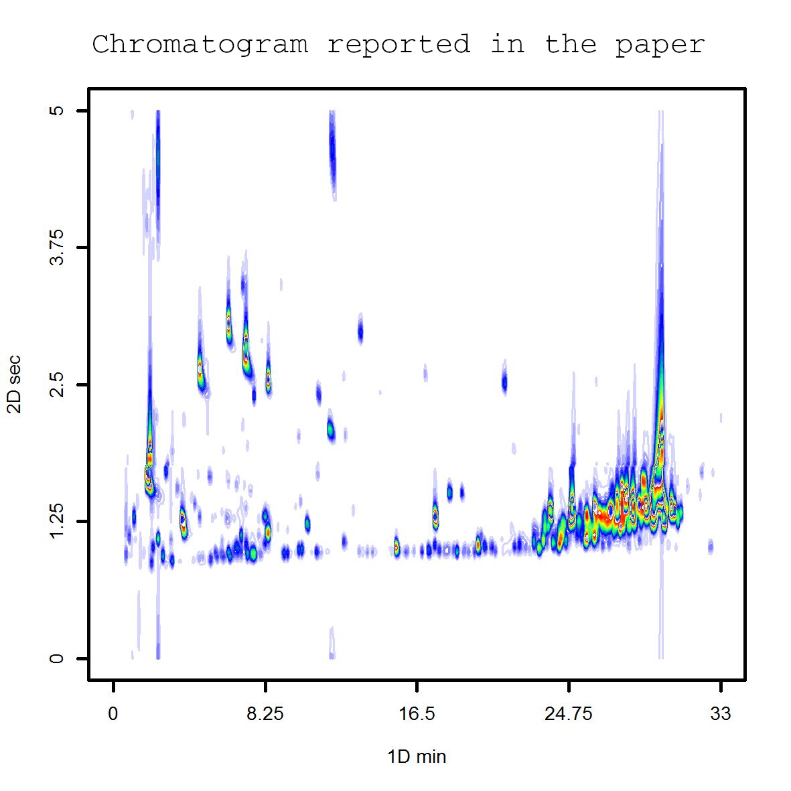

<style>
body {text-align: justify}
</style>


# Introduction
The traditional chromatography provides two type of signals, (a) retention
time and (b) signal intensity. The sampling rate (MHz) defines the number
of points that the detector is capable to measure per second. Each discrete
point contributes to create a continuous time signal. A single run can be
described as $A_{i}$ where $i$ is the number of scan points in the
chromatographic run.

This is not the case of comprehensive chromatography (GCxGC). In the case of
GCxGC, there is a second column connected with the first column
by a modulator. The chemistry of the second column is usually different
than the first column, some authors claims this difference as an
orthogonal separation. 
Although, it can not be always achieved since the chemistry of both columns
is not 100% opposite. Therefore, the second column is considered as a
second chromatographic dimension. Thus, a single two-dimensional chromatogram
can be described as a set of modulations $k$, where each modulation has a
set of scans $i$. Then, a 2D chromatogram can be described as $A_{i,k}$.

The new structure dimensions ($A_{i,k}$) requires a different display
layout than the most common XY-plot. There are two approaches to handle this
issue: contour based plots or three dimensional plots. In the current
package version, 3D plots are not supported. Even though, we provide
contour based plots to visualize your chromatograms.


# Understanding GCxGC class

The RGCxGC package creates a S4 data format, and one chromatogram can
storage multiple information in a single R object. For example:

```{r slots, message=FALSE, warning=FALSE, paged.print=FALSE}
library(RGCxGC)
chrom_08 <- system.file("extdata", "08GB.cdf", package = "RGCxGC")
MTBLS08 <- read_chrom(chrom_08, mod_time = 5, verbose = F)
slotNames(MTBLS08)
```


the *MTBLS08* chromatogram has four slots:

* **chromatogram**: Two-dimensional matrix
* **time**: the time range of the chromatographic run
* **name**: the chromatogram name
* **mod_time**: the modulation time of the second dimension.

In this library, the `RGCxGC::plot()` function will retrieve the
chromatogram slot in order to plot the chromatogram. Additionally, the plot
functions also uses the time and mod_time slot to set the plot axis.

# Basic chromatogram plot
The following chromatogram is retrieved from
[MetaboLights](https://www.ebi.ac.uk/metabolights/) database with
the [MTBLS579](https://www.ebi.ac.uk/metabolights/MTBLS579)
identifier, the file names is 08_GC.cdf.

The provided `RGCxGC::plot()` is built in the `graphics::contour` and
`graphics::filled.contour()` functions. By default, the `RGCxGC::plot()`
will use the filled contour approach.

```{r default, fig.align='center'}
plot(MTBLS08)
```

The color palette of this chromatogram might not be suitable. One of 
the most popular color palette employed in chromatogram visualization comes
from MATLAB. The `colorRamps` package includes two palettes to overcome this
issue, the `matlab.like` and `matlab.like2` functions. 

Before to change the chromatogram color palette, we would like to make emphasis
that the back-end function employed in this plot, is the `filled.contour`
function. To change the palette, we have to provide the function that creates
the palette.


```{r color_palette, fig.align='center'}
library(colorRamps)
plot(MTBLS08, type = "f", color.palette = matlab.like,
     main =  "matlab.like")

plot(MTBLS08, type = "f", color.palette = matlab.like2,
     main =  "matlab.like2")
```


We spot some similarities between this two palettes. First of all, the
palette button and upper limits are very similar. Even though, the
`matlab.like2` function has more color breaks, what in this case,
makes the chromatogram to look better. For example, in the `matlab.like`
palette the variation of lower signals intensities is obscured by a blue
degradation. On the other hand, the `matlab.like` palette highlight the
background variation. Moreover, the color palette
is highly dependent of the chromatogram as we are going to detail in the
following sections.

# TOF vs. Quadrupole
The MS detector comes in some flavors, which two of the most common
mass analyzers are Time of flight and Quadrupole. They are very different about
how they work. For example, TOF mas analyzer can acquire
spectra in high resolution meanwhile the quadrupole mass analyzer is not
capable of. Additionally, the sampling rate achieved by TOF is higher than
quadrupole. Therefore, chromatograms acquired with TOF mass analyzer are
usually dimensionally higher ($> i$). 

The previous chromatogram was acquired with TOF mass analyzer, thus
TIC intensities are about $4x10^5$ and background intensities are
about $1x10^5$. This is not the case of the quadrupole.

The following chromatogram is retrieved from the package
[article](https://doi.org/10.1016/j.microc.2020.104830). In contrast
with the previous chromatogram, the next chromatogram was acquired with
a quadrupole mas analyzer.


```{r message=FALSE, warning=FALSE, paged.print=FALSE, fig.align='center'}
myl_d5 <- system.file("extdata", "mylbd5.CDF", package = "RGCxGC")
myl <- read_chrom(myl_d5, mod_time = 5, sam_rate = 25, verbose = F)
plot(myl, color.palette = matlab.like2 )
```

Moreover, the chromatogram included in the paper is very different.

```{r Fig 1, echo=FALSE, out.width= "60%",message=FALSE, warning=FALSE, paged.print=FALSE, fig.align='center'}

```


The first difference is the number of features presented in both
chromatograms. In the second chromatogram there are much more features.
Additionally, the peaks are traslocated and they are not in the same
retention time in the second dimension.

We are going to address this issues in four steps:

- Chromatogram dephasing
- Changing the type of the plot
- Creating a personalized color palette
- Changing the number of levels (breaks)

## Chromatogram dephasing
In two-dimensional chromartography, the modulation time may lead a
peak partition. It is because the modulator does not inject the total
peak volume in the modulation $(i)$, and reinjects the remaining peak volume in the
next modulation $(i+1)$. The first chromatogram that we plot in the section 4
presents this challenge. Therefore, in order to improve the chromatogram
visualization and interpretation, the chromatogram is scrolled in the second
dimension.

```{r}
myl_deph <- dephase_chrom(myl, rel_dephase = 65)
plot(myl_deph, color.palette = matlab.like2 )
```

The `dephase_chrom` scrolls the chromatogram by a given scrolling percentage.
In this example, the second retention time has been scrolled 75%. We
notice that the higher intensities are now in the same retention times.

## Changing the type of plot
As aforementioned, the default plot type is the filled contour. Even though,
compound concentrations is usually uneven in untargeted analysis. Therefore
compounds in a low concentration are not going to be displayed with the
current approach. In this case, we can opt for the `contour` plot. The
major difference between these two types of plots is how you provide
colors. In this case, you have to specify the colors, and not the function
that creates those colors, and you have to specify `type = "c"`.

```{r}
plot(myl_deph, type = "c",col = matlab.like2(10) )
```
We start noticing that more features came out. This is because low signals
were obscured by the background signal.

## Creating a personalized color palette
Although the `matlab.like` and `matlab.like2` functions provides a fast
solution for colors, other purposes may need other colors. Thus, 
we are going to explain how to create a personalized color palette.

Basically, the `colorRampPalette` function will be use. This function
create a color palette function with the provided colors. The provided
colors will be used as breaks.


```{r}
my_palette <- colorRampPalette(rev(c("red","yellow","springgreen",
                                     "blue", "white")))
plot(myl_deph, type = "c", col = my_palette(10) )
```

With the customized `my_palette` function the chromatogram visualization was
improved. We are almost done but more low concentration compounds are till
obscured.

## Changing the number of levels
The number of levels is a critical argument to take into consideration to
create an effective chromatogram visualization. This argument affect in how
many breaks the signal will be splitted. For example, if `nlevels = 10` the
total TIC signal will be splitted in 10 equally spaced breaks. If you
set this argument to a greater value, the total TIC signal will be splitted
in more breaks, which enhance the feature visualization.


```{r}
plot(myl_deph, type = "c", col = my_palette(35), nlevels = 100 )
```

As we notice, now we have a similar chromatogram with the reported in the
paper.

**Tip**: in this case of plots, the number of levels and the number of colors
should be the equal for low levels (nlevels < 50). On the other hand,
for nlevels > 50, nlevels should be twice or three times the number of colors.
